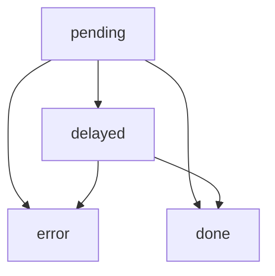

# promised

A Vue component made for handling promises in the view.

## States

When this component is initialized, the state is set to `pending`. If enough time passes (as defined by the `delay` prop),
then the state becomes `delayed`. Once the promise finishes (including if `delayed` is skipped), the state either
becomes `error` or `done`.



## Slots

There is a slot for each state. The only oddity is that `done` state is the `default` slot.

| State    | Slot    | Parameters |
| -------- | ------- | ---------- |
| pending  | pending | (none)     |
| delayed  | delayed | (none)     |
| error    | error   | `error` - The contents of the rejected promise<br>`errorString` - Best guess of a summary of the error |
| done     | default | `data` - The contents of the fulfilled promise |

## Input / Forms

If the data being loaded has relevance to a form, and you don't want the user to be able to submit the form
without the promise, use the prop `inputRequired`. When true, unless the `state` is `done`, a hidden input will
be present with a `required` attribute on it.

## Usage

```html
<Promised :promise="users" name="User Information" inputRequired>
	<template v-slot="{ data: users }">
		<select required>
			<option v-for="user in users" :id="user.id">{{user.name}}</option>
		</select>
	</template>
</Promised>
```
